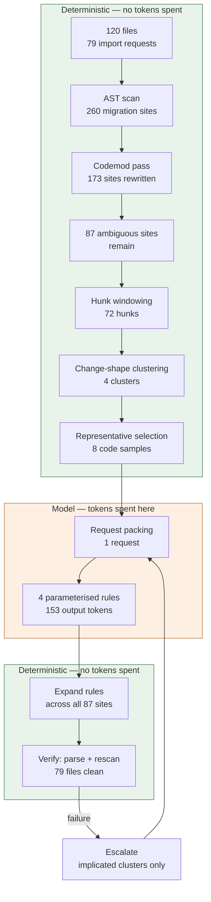
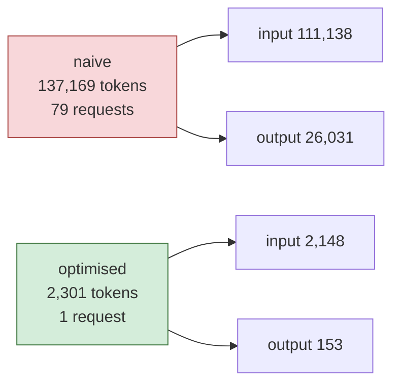
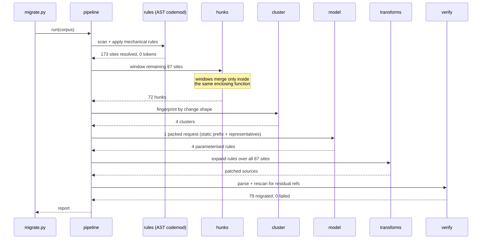
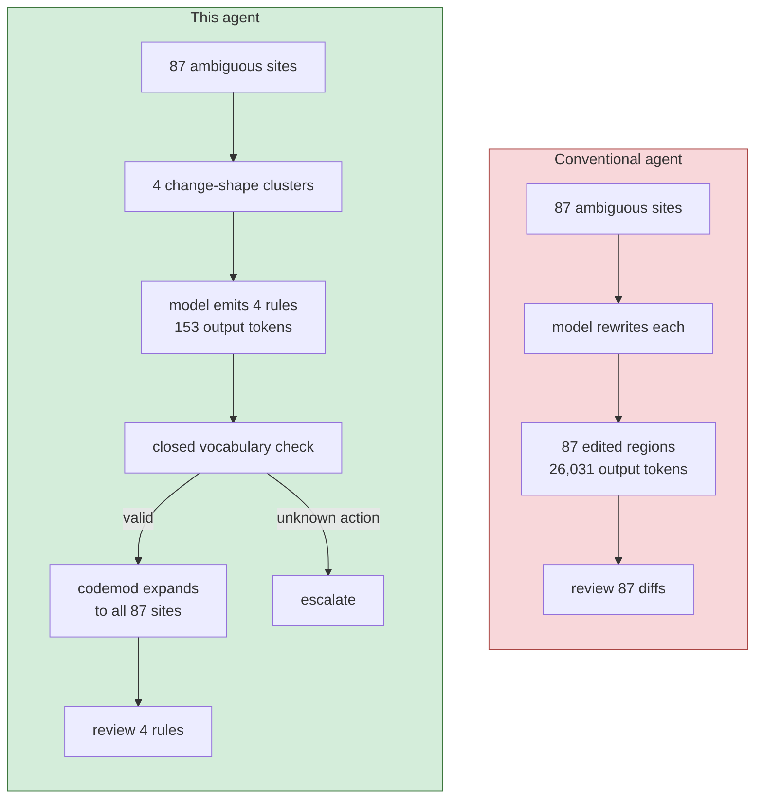
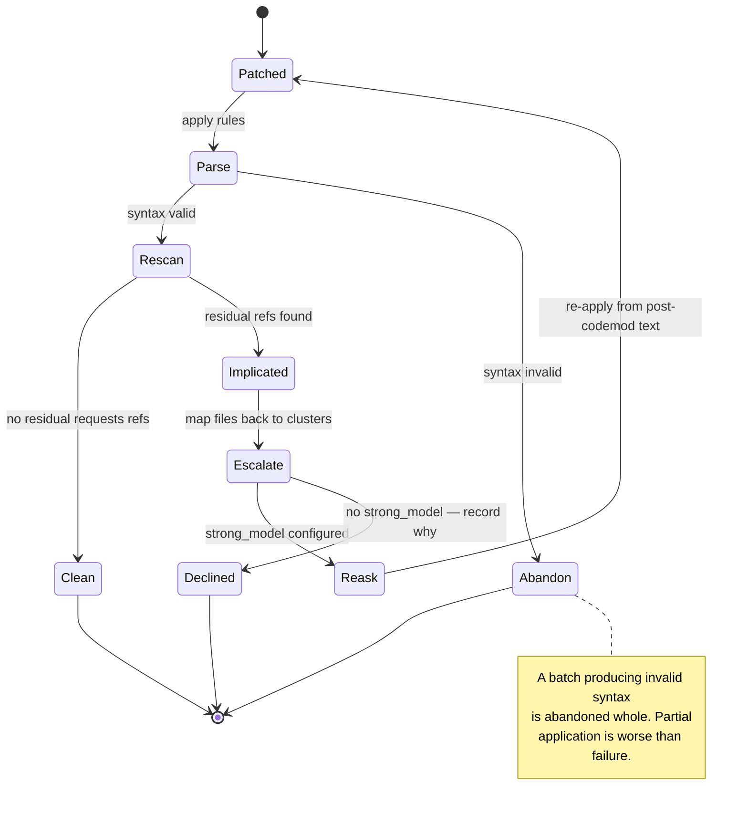

# migration-agent

A library-migration agent (`requests` → `httpx`) built to answer one question:

> When an LLM has to make the same judgement call 87 times across a codebase,
> how few tokens can you get away with?

On a 120-file corpus with 260 migration sites, the answer measured here is
**137,169 → 2,301 tokens, a 98.3% reduction**, with 79 model requests collapsed
into 1 — and every migrated file verified by parsing it and re-scanning it for
residual references.

Everything runs offline. There is no API key, no network call, and no mocked
token count: the corpus is generated deterministically, the model is a real
prompt parser, and every number below is produced by `benchmarks/` in CI.

---

## The idea

Most "cheap LLM" write-ups are about compressing the prompt. The larger win
here is on the other side of the call.

**The model never writes code. It writes a rule, and a deterministic codemod
runs that rule.**

A conventional agent asked to fix 87 ambiguous sites returns 87 edited regions.
This one returns something closer to six lines:

```
CLUSTER c1 -> set_timeout(value=120.0)
CLUSTER c2 -> set_timeout(value=10.0)
CLUSTER c3 -> map_exception(from=requests.exceptions.ConnectionError, to=httpx.ConnectError)
CLUSTER c4 -> map_exception(from=requests.exceptions.HTTPError, to=httpx.HTTPStatusError)
```

Three things follow from that, and they are the whole design:

1. **Output cost becomes `O(clusters)`, not `O(sites)`.** Measured: 153 output
   tokens instead of 26,031.
2. **The blast radius is reviewable before it lands.** A human reads four rules,
   not four hundred diff hunks.
3. **The model cannot invent an edit.** The action vocabulary is closed —
   `set_timeout`, `map_exception`, `rename_symbol`. Anything else fails to parse
   and escalates. This is a safety property you get for free from the token
   optimisation, which is unusual; normally they trade against each other.

The honest failure mode: a migration that genuinely needs bespoke per-site
handling degrades to one cluster per site and the win evaporates.
`cluster.stats()["compression"]` is the canary for exactly that.

---

## Architecture

### The funnel

Each stage exists to make the next stage's input smaller. The model sits at the
narrow end and sees roughly 1.5% of what a naive agent would send it.



### Where the tokens go

The naive bar is not a straw man. It uses a genuinely complete migration
rulebook as its system prompt and sends whole files, which is what a
one-shot-per-file agent actually does.



### A single run



### The model writes the rule

This is the part that makes output cost independent of codebase size.



### Verification and escalation

Escalation is scoped to the **clusters implicated in a failure**, not the failing
files. A file fails because a rule was wrong — and that rule is wrong everywhere
it landed, so re-asking per file would pay for the same mistake many times.



---

## Measured results

Reproduce with `python benchmarks/compare.py`.

```
CORPUS
  120 files, 79 import requests
  260 migration sites (173 mechanical, 87 ambiguous)

NAIVE vs OPTIMISED
                                 naive   optimised     saved
------------------------------------------------------------
model requests                      79           1     98.7%
input tokens                   111,138       2,148     98.1%
output tokens                   26,031         153     99.4%
total tokens                   137,169       2,301     98.3%
cost (as run)                  $0.5382     $0.0004     99.9%
cost (same model)              $0.5382     $0.0069     98.7%

WHERE THE WORK WENT
  resolved by codemod    173 sites  (no tokens)
  resolved by model       87 sites
  hunks after merging     72
  clusters asked about     4
  requests sent            1

CORRECTNESS: 79 migrated, 0 failed verification, 0 declined
```

Two cost rows on purpose. `as run` bundles in the win from routing narrow,
well-specified cluster questions to a cheap model — real, but it is a routing
win, not a token win. `same model` prices both sides at the strong model and
isolates the token reduction on its own: **98.7%**.

### Lever ablation

Each row turns off exactly one lever. Reproduce with
`python benchmarks/ablation.py`.

| configuration | tokens | vs naive | reqs | clusters | cost of removing |
|---|---:|---:|---:|---:|---|
| naive (whole files) | 137,169 | 0.0% | 79 | 0 | — |
| **all levers on** | **2,301** | **98.3%** | **1** | **4** | — |
| no deterministic pass | 4,694 | 96.6% | 2 | 9 | +104% tokens, **76 files FAILED** |
| no hunk windowing | 14,973 | 89.1% | 7 | 10 | +551% tokens |
| no clustering | 26,707 | 80.5% | 12 | 72 | +1061% tokens |
| no request packing | 3,646 | 97.3% | 4 | 4 | +58% tokens |
| no exemplar retrieval | 2,069 | 98.5% | 1 | 4 | **−10% tokens** |

Two rows in that table are worth more than the headline number.

**The deterministic pass is load-bearing for correctness, not cost.** Turning it
off costs only ~2× in tokens, but leaves 76 of 79 files unmigrated. The closed
action vocabulary deliberately covers only the ambiguous residue, so with the
codemod off there is no action that can migrate a plain `requests.get`. The
model declines rather than improvising — which is the behaviour you want, and
the opposite of how a cost "pre-filter" is usually described.

**Removing exemplars saves tokens.** They cost roughly 250 tokens per request
and buy answer quality, which an offline harness scores at zero. Judging them on
this table alone would be exactly the wrong conclusion. It is in the table
because leaving it out would be dishonest about what the harness can and cannot
see.

---

## Two bugs worth writing down

### Hunk windows merged across function boundaries

`_merge_spans` originally coalesced windows on **line proximity alone**. The last
call of one function would merge with the first call of the next. The merged
hunk then carried sites from two different functions, landed in a single
cluster, and received a **single** answer.

Concretely: a nightly export and an interactive page-load handler sitting next to
each other in a file would both get a 120-second timeout, or both get 10. The
file still parses. The tests still pass. The diff looks fine in review.

The fix keys merging on the enclosing `def` rather than on line distance.

It cost about 4% more tokens at the hunk stage (12,585 → 13,127) — a deliberate,
documented trade. But the second-order effect was the surprise: mixed-signature
hunks had been **fragmenting the cluster space**, producing 10 noisy clusters
instead of the 4 genuine change shapes. Fixing the correctness bug cut total
spend roughly 3× (6,591 → 2,301). Pinned by
`test_windows_do_not_merge_across_function_boundaries`,
`test_sites_within_one_function_still_merge` (the inverse — over-correcting into
no merging at all would be its own regression), and
`test_batch_and_interactive_get_different_timeouts`.

### The benchmark's ground truth was wrong in the flattering direction

The corpus generator counted **templates emitted**, not **migration sites**.
Several templates emit more than one site — the retry template contains a
mechanical `requests.post(timeout=20)` *plus* two `except` clauses. The codemod
was therefore being under-credited in its own benchmark.

Wrong numbers that make your work look worse are still wrong numbers, and they
are harder to notice. The scanner now matches ground truth exactly on all six
shapes, asserted in `tests/test_rules.py`.

---

## Quick start

```bash
pip install -r requirements.txt

python -m pytest tests/ -q        # 70 tests, no network
python benchmarks/compare.py      # naive vs optimised
python benchmarks/ablation.py     # per-lever contribution

python migrate.py --explain       # stage-by-stage trace of one run
python migrate.py --show          # the rules the model actually returned
python migrate.py --path ./src --write
```

`--write` refuses to write unless verification passes.

No `.env` file and no API key: `model.OfflineModel` genuinely parses the prompt
and derives its answers from cluster shape and representative source, so a
prompt-format regression fails CI instead of silently degrading in production.

---

## Layout

| path | role |
|---|---|
| `src/migrator/rules.py` | AST codemod, site scanner, edit application |
| `src/migrator/hunks.py` | Line windowing, function-boundary-aware merging |
| `src/migrator/cluster.py` | Change-shape fingerprinting, representative selection |
| `src/migrator/transforms.py` | The closed action vocabulary |
| `src/migrator/prompts.py` | Byte-stable static prefix (cache key) |
| `src/migrator/packer.py` | Multi-cluster request batching under budget |
| `src/migrator/verify.py` | Parse + residual-reference rescan |
| `src/migrator/pipeline.py` | Orchestration, escalation, reporting |
| `src/migrator/corpus.py` | Deterministic synthetic codebase + answer key |
| `src/migrator/model.py` | Offline model, usage ledger, prefix-cache accounting |
| `benchmarks/` | `compare.py`, `ablation.py` — both run in CI |

Further reading: [architecture](docs/architecture.md) ·
[tuning](docs/tuning.md) · [evaluation](docs/evaluation.md).

## License

MIT
