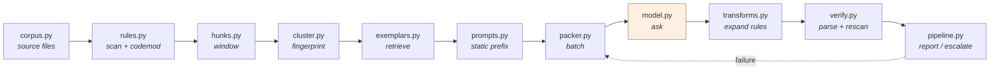

# Architecture

The pipeline has one organising rule: **every stage before the model exists to
make the model's input smaller, and every stage after it exists to make the
model's output go further.** Tokens are spent in exactly one place.

## Stage 1 — `rules.py`: the deterministic pass

An AST visitor classifies every `requests` usage into a **shape**. Shapes split
into two populations:

- **Mechanical** (173 of 260 sites): there is exactly one correct rewrite.
  `requests.get(...)` → `httpx.get(...)`, `requests.Session()` →
  `httpx.Client()`. These never reach the model.
- **Ambiguous** (87 sites): the correct rewrite depends on intent. A call with
  no timeout needs *a* timeout, but the right value depends on whether the
  enclosing function is a nightly batch job or an interactive request handler.

Exception handlers are **never** migrated mechanically. `requests` and `httpx`
do not have parallel exception hierarchies — `requests.exceptions.HTTPError`
maps to `httpx.HTTPStatusError`, and several mappings are genuinely one-to-many.
A mechanical mapping here would be silently wrong, and silently wrong error
handling is the worst possible outcome of a migration.

Two implementation details that are load-bearing:

**`apply_edits` applies spans last-to-first.** Applying forwards invalidates
every subsequent offset. This is the classic codemod bug and it is insidious
because the output usually still parses.

**`has_residual_references` is AST-based, not substring-based.** The corpus
mentions "requests" in docstrings and URL strings. A substring check would send
correctly-migrated files into an infinite escalation loop.

## Stage 2 — `hunks.py`: windowing

A site is a line number; the model needs surrounding context to judge intent. A
window is 6 lines either side, extended to include the enclosing `def`
signature, capped at 400 tokens.

Nearby windows are merged — but **only when they share an enclosing function**.
See the war story in the README; merging on line proximity alone silently gave
a batch job and an interactive handler the same answer.

`Hunk.site_lines` carries the exact finding lines, so the transform stage edits
real sites rather than context padding. `Hunk.render()` emits line numbers,
which is what makes patch-shaped responses possible at all.

## Stage 3 — `cluster.py`: change-shape fingerprinting

The key insight: **87 sites are not 87 questions.** A fingerprint is built from
the site shape plus the enclosing context kind (`fn:batch`, `fn:interactive`,
`in:try`, `in:loop`). Sites sharing a fingerprint need the same answer by
construction.

On this corpus 72 hunks collapse into 4 clusters — and those 4 are exactly the
genuine change shapes: batch timeout, interactive timeout, connection-error
mapping, status-error mapping.

`representatives()` picks the **smallest** members, not the first or a random
sample. Large members carry incidental code the model overfits to, producing
rules narrower than the cluster they must cover.

`stats()["compression"]` is the health metric. If it approaches 1.0, the
migration needs per-site judgement and this architecture is the wrong tool.

## Stage 4 — `prompts.py` and `packer.py`

`prompts.py` is dependency-free and produces a **byte-identical** static prefix
on every call. That is the whole point: providers key prefix caching on exact
bytes, so a single interpolated count or timestamp silently doubles input spend.
`test_system_prompt_is_stable_across_runs` asserts the property directly rather
than inferring it from a cache-hit count.

`PROMPT_VERSION` is bumped by hand so cache metrics from different prompt
generations are never averaged together.

`packer.py` batches multiple clusters into one request under a 2,400-token
payload budget and a 6-item cap. Packing matters because the static prefix is
paid **per request**, so four questions in one request pay for the prefix once.
Worth +58% on this corpus.

`NAIVE_SYSTEM_PROMPT` is a deliberately fair baseline: a genuinely complete
migration rulebook, not a straw man. The comparison would be worthless
otherwise.

## Stage 5 — `transforms.py`: the closed vocabulary

`KNOWN_ACTIONS = {set_timeout, map_exception, rename_symbol}`. Anything outside
this set fails to parse and escalates. The model cannot invent an applicable
edit — it can only select and parameterise one.

`apply()` **re-parses between each transform**, because offsets drift as edits
land. A batch that produces invalid syntax is **abandoned whole**: partial
application leaves a file in a state nobody designed and nobody reviewed.

`set_timeout` is **idempotent**, skipping calls that already have a timeout,
because verification failure causes retries and a non-idempotent transform would
stack arguments on the second pass.

`_last_argument_end()` inserts after the final argument rather than before the
closing paren, which handles multi-line calls with trailing commas cleanly.

## Stage 6 — `verify.py` and escalation

Verification is two checks: the file must parse, and an AST rescan must find no
residual `requests` references.

Missing-timeout warnings are **warnings, not failures**. Post-migration the call
inherits httpx's 5-second default, so it is bounded. Failing it would burn
strong-model tokens on a non-problem.

Escalation re-asks about the **clusters implicated in a failure**, not the
failing files — a file fails because a rule was wrong, and that rule is wrong
everywhere it landed. Re-asking per file would pay repeatedly for one mistake.
It always re-applies from the post-codemod text, never from already-patched
output.

With no `strong_model` configured it **records why it declined** rather than
retrying the same model on the same input and expecting a different answer. The
counters are split deliberately: `declined` means the model emitted `ESCALATE`;
`escalations` means the work was re-asked on the strong model.
