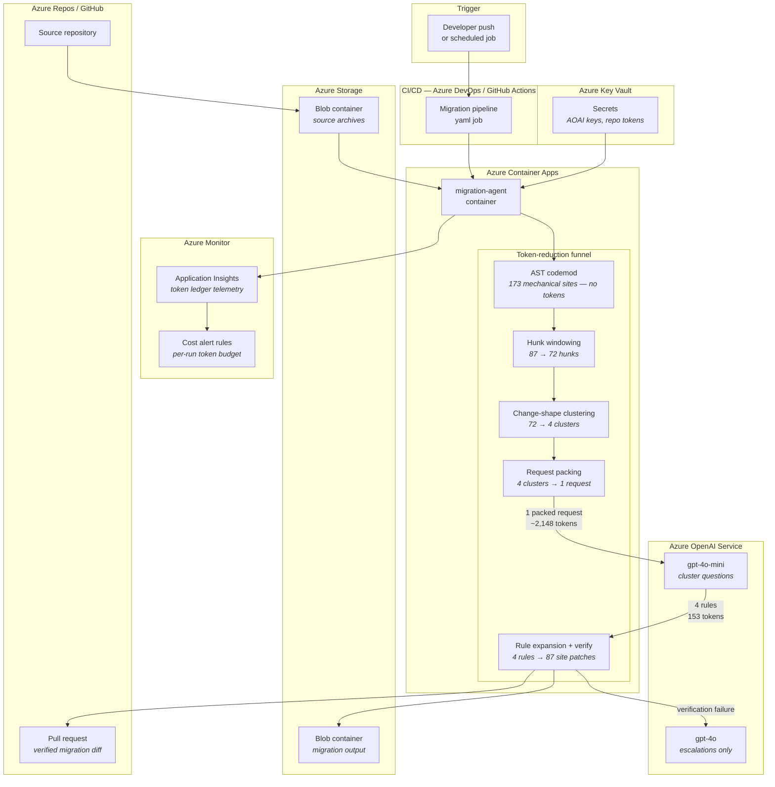
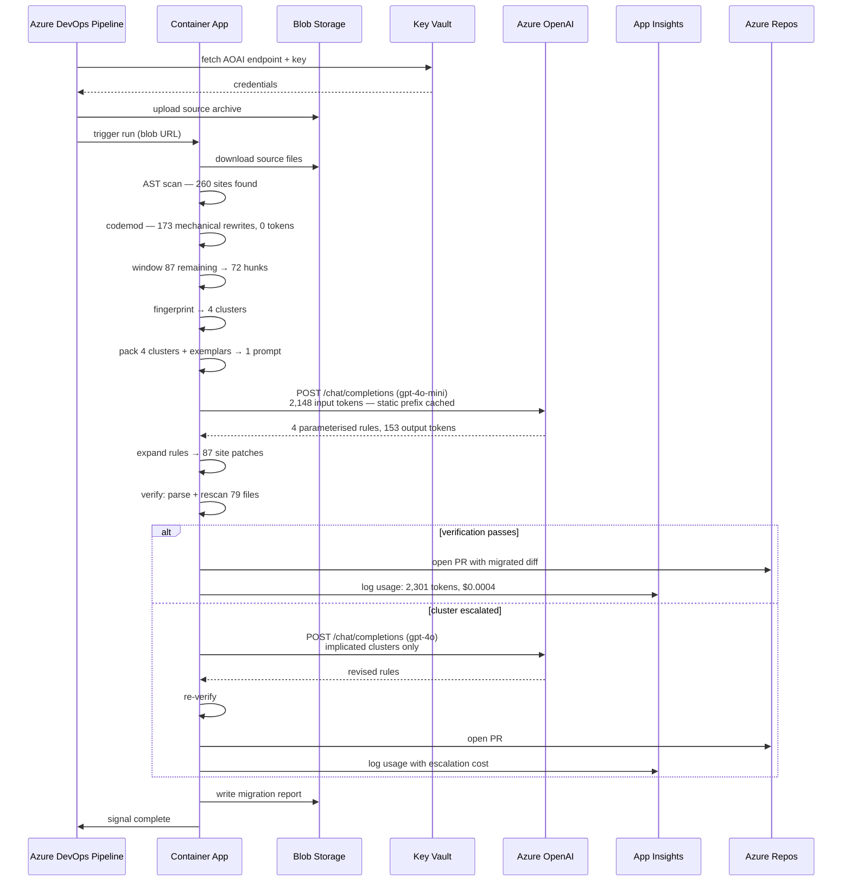
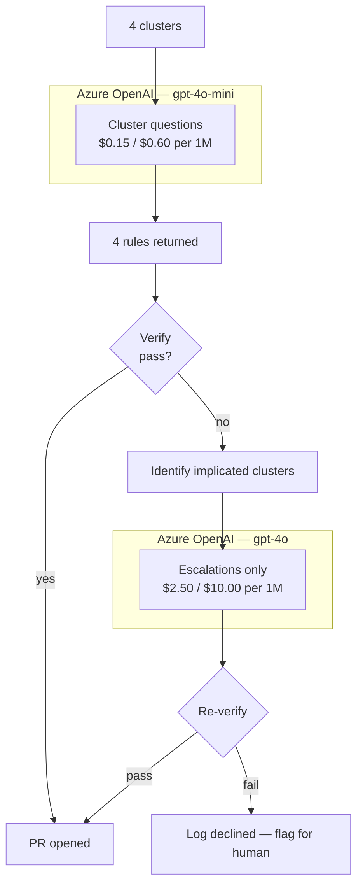

# Azure Solution Architecture

This document describes how to deploy the migration agent as a production service on Azure, replacing the local `OfflineModel` with **Azure OpenAI Service** and integrating the agent into an enterprise CI/CD pipeline.

---

## Overview

The migration agent is structured as a deterministic funnel with a single, narrow model call at the centre. That structure maps cleanly onto Azure: the heavy lifting (AST scan, clustering, verification) runs in a container, the model call goes to Azure OpenAI, and the result lands as a pull request in Azure Repos or GitHub.

The key property to preserve in any deployment is that the **static system prompt remains byte-identical across calls** — this is what engages Azure OpenAI's prompt-caching discount (50% on cached prefix tokens). A single dynamic variable (timestamp, run ID) in the system prompt silently halves the cache-hit rate and doubles input spend.

---

## High-Level Architecture



---

## Data Flow



---

## Component Map

| Azure service | Role | Notes |
|---|---|---|
| **Azure Container Apps** | Hosts the migration-agent container | Scale to zero between runs; stateless per execution |
| **Azure OpenAI Service** | `gpt-4o-mini` for cluster questions; `gpt-4o` for escalations | Deploy both models in the same AOAI resource |
| **Azure Blob Storage** | Source archive in, migration report out | Two containers: `migration-input`, `migration-output` |
| **Azure Key Vault** | AOAI endpoint + key, repo PAT | Container App uses managed identity to read secrets |
| **Application Insights** | Token ledger telemetry, per-run cost | Emit `model.Ledger` fields as custom metrics |
| **Azure Monitor** | Cost alert rules | Alert when a run exceeds token or dollar budget |
| **Azure DevOps / GitHub Actions** | CI trigger, PR creation | Pipeline passes blob URL; agent opens PR via API |
| **Azure Container Registry** | Stores the agent image | Pulled by Container Apps on each revision |

---

## Prompt-Cache Alignment with Azure OpenAI

Azure OpenAI applies a **50% discount on repeated prefix tokens** when the prompt prefix is byte-identical across calls. The agent is designed around this:

- `prompts.py` produces a `SYSTEM_PROMPT` that never changes between runs — no timestamps, no run IDs, no file counts.
- `test_system_prompt_is_stable_across_runs` asserts this directly in CI.
- `model.Ledger` bills cached tokens at 50% and reports the saving.

In a single run against the 120-file corpus, prefix caching saves ~450 tokens. At enterprise scale with repeated daily runs, the cache benefit compounds: the same prompt prefix stays warm in the Azure OpenAI tier's cache across deployments as long as the static prefix bytes do not change.

**Do not** add a `PROMPT_VERSION` variable or run timestamp to the system prompt. If the prompt needs to change, bump `PROMPT_VERSION` as a code change (which invalidates the cache intentionally) and update the test assertion.

---

## Escalation Routing



The strong model is never called on a first pass — only when the cheap model's rules fail verification. On the synthetic corpus, escalation does not occur. On a real codebase, `config.EscalationBudget` controls the attempt count for each tier.

---

## Enterprise Cost Savings

All figures use the same token counts as the measured corpus (120 files, 260 sites) scaled linearly by file count. The optimised column uses **same-model pricing** (both sides at gpt-4o rates) to isolate the token reduction from the model-routing win.

Azure OpenAI list prices used: gpt-4o at $2.50 input / $10.00 output per 1M tokens.

### Token volumes at scale

| Scale | Files | Naive tokens | Naive requests | Optimised tokens | Optimised requests |
|---|---:|---:|---:|---:|---:|
| Corpus (measured) | 120 | 137,169 | 79 | 2,301 | 1 |
| Small team | 500 | ~572,000 | ~329 | ~9,600 | ~4 |
| Mid-size org | 5,000 | ~5,720,000 | ~3,292 | ~96,000 | ~34 |
| Enterprise | 50,000 | ~57,200,000 | ~32,917 | ~960,000 | ~338 |

> **Clustering scales sub-linearly.** On the 120-file corpus, 72 hunks collapse to 4 clusters. A real 50,000-file codebase shares the same small vocabulary of change shapes — batch timeouts, interactive timeouts, connection-error mappings — so cluster count grows much more slowly than file count. The figures above use linear scaling of token volumes as a conservative upper bound; actual optimised costs will typically be lower.

### Cost comparison (same model — gpt-4o both sides)

| Scale | Files | Naive cost | Optimised cost | Saving |
|---|---:|---:|---:|---:|
| Corpus (measured) | 120 | $0.54 | $0.0069 | **98.7%** |
| Small team | 500 | $2.24 | $0.029 | **98.7%** |
| Mid-size org | 5,000 | $22.4 | $0.29 | **98.7%** |
| Enterprise | 50,000 | $224 | $2.90 | **98.7%** |

### Cost comparison (as run — cheap model routing)

Using gpt-4o-mini ($0.15 input / $0.60 output per 1M) for cluster questions, gpt-4o only for escalations:

| Scale | Files | Naive cost (gpt-4o) | Optimised cost (gpt-4o-mini) | Saving |
|---|---:|---:|---:|---:|
| Corpus (measured) | 120 | $0.54 | $0.0004 | **99.9%** |
| Small team | 500 | $2.24 | $0.0017 | **99.9%** |
| Mid-size org | 5,000 | $22.4 | $0.017 | **99.9%** |
| Enterprise | 50,000 | $224 | $0.17 | **99.9%** |

The "as run" column bundles a routing win (cheap vs strong model) with the token-reduction win. The "same model" column isolates the token reduction on its own — **98.7%** — which is the portable number: it holds regardless of which model you choose.

### Monthly recurring cost (continuous migration pipeline)

For an enterprise running weekly migrations across 50,000 files:

| | Naive (gpt-4o) | Optimised (gpt-4o-mini) |
|---|---:|---:|
| Per run | $224 | $0.17 |
| Per month (4 runs/week × 4 weeks) | $3,584 | $2.72 |
| **Annual saving** | | **$43,000** |

---

## Infrastructure as Code sketch

```yaml
# azure-pipelines.yml (outline)
trigger:
  - main

pool:
  vmImage: ubuntu-latest

steps:
  - task: AzureCLI@2
    displayName: Run migration agent
    inputs:
      azureSubscription: migration-agent-sc
      scriptType: bash
      scriptLocation: inlineScript
      inlineScript: |
        az containerapp job start \
          --name migration-agent \
          --resource-group rg-migration \
          --environment cae-migration \
          --env-vars \
            AZURE_OPENAI_ENDPOINT=$(AOAI_ENDPOINT) \
            SOURCE_BLOB_URL=$(SOURCE_BLOB_URL) \
            TARGET_REPO=$(TARGET_REPO)
```

Key configuration in the Container App:
- Managed identity bound to Key Vault for secret access
- `AZURE_OPENAI_ENDPOINT` and `AZURE_OPENAI_API_KEY` injected at runtime
- `PROMPT_VERSION` pinned in the container image (not an environment variable)

---

## Monitoring and Alerting

Emit `model.Ledger` fields as Application Insights custom events:

```python
# In pipeline.py, after each run
telemetry.track_event("migration_run", {
    "total_tokens": report.usage.total_tokens,
    "cached_tokens": report.usage.cached_tokens,
    "model_requests": report.usage.requests,
    "cost_usd": report.usage.cost_usd,
    "clusters": report.cluster_count,
    "files_migrated": report.files_migrated,
    "escalations": report.escalations,
})
```

Recommended alert rules:
- `total_tokens > 10,000` per run — signals the clustering compression ratio has degraded
- `escalations > 0` — signals the cheap model is failing on a pattern type
- `cost_usd > $1.00` per run — cost budget gate before merging results

The `cluster.stats()["compression"]` ratio is the leading indicator: if it falls below 3:1 (fewer than 3 hunks per cluster on average), the architecture is no longer the right tool and a per-file agent should be evaluated instead.
